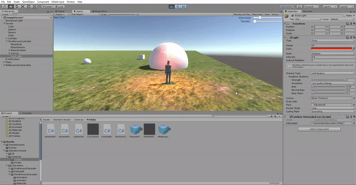

# Juego

### Delegados, Eventos
* Crear un escenario básico para la escena del proyecto para la evaluación final.
* Agregar dos tipos de GameObject de los que haya varias instancias en la escena.
* Implementar un controlador de escena usando el patrón delegado que gestione las siguientes acciones:
  * Si el jugador choca con un objeto de tipo A se incrementa su poder.
  * Si el jugador choca con objetos de tipo B, todos los de ese tipo sufrirán alguna transformación o algún cambio en su apariencia y decrementarán el poder del jugador.
  * Incorporar un elemento que sirva para encender o apagar un foco utilizando el teclado.
  
  
 
 
 
### Interfaz de Usuario en Unity
* Agregar un objeto Canvas para generar una interfaz de usuario que permita las siguientes acciones en la escena:

  * Aumentar o disminuir la intensidad de una de las fuentes de luz.
  * Aumentar o disminuir el tamaño de los objetos A de la escena.
 
 
